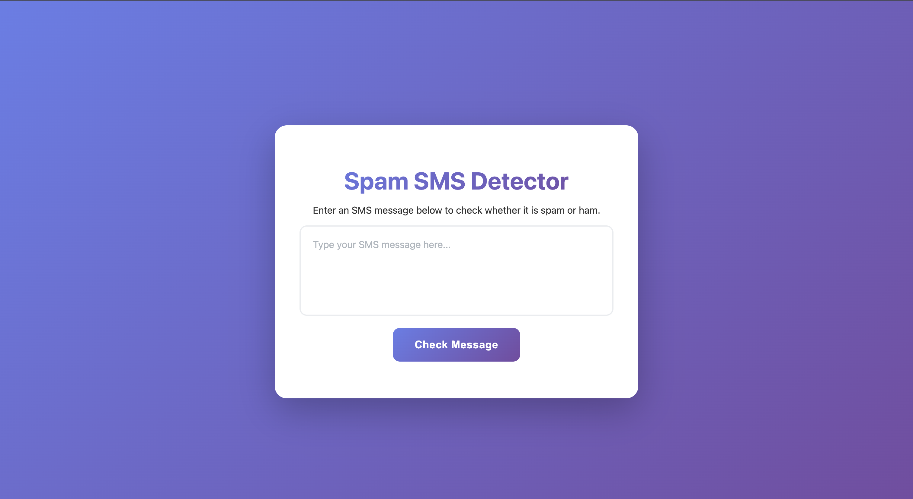
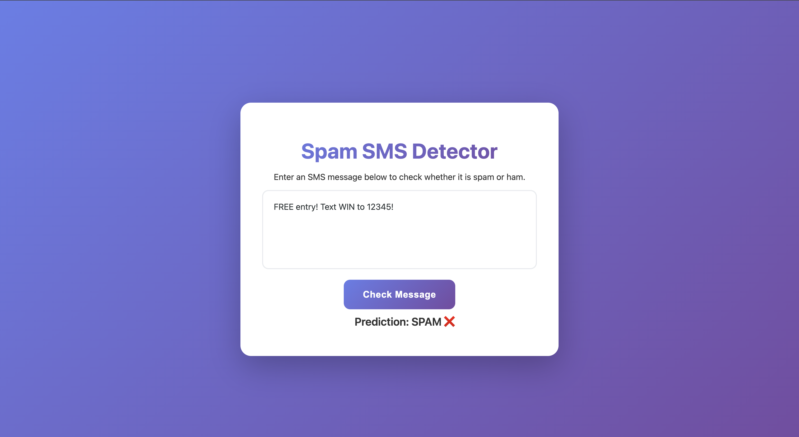
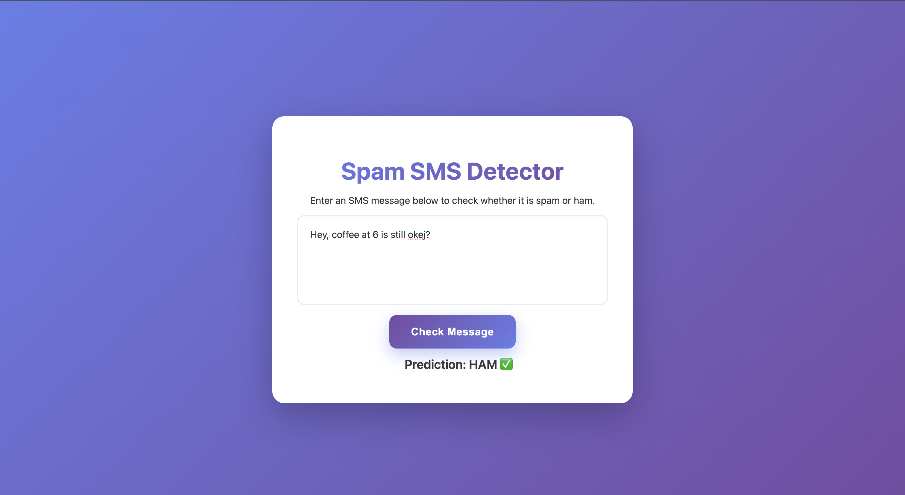

# 📱 SMS Spam Detector

A lightweight browser-based machine learning application that classifies SMS messages as Spam or Ham. The project was developed as a university course project and designed to allow students to test messages interactively through a simple web interface.

**🌐 Try it out:** [SMS Spam Detector](https://farishasanbegovic.github.io/PY_PROJECT/)

---

## 🔍 Overview

The application provides a simple interface where users can:

- Enter an SMS message
- Submit the message for analysis
- Receive a Spam or Ham classification
- Test the model with real or example SMS messages

---

## 🛠 Technologies

| Technology | Purpose |
|------------|---------|
| HTML | Webpage structure |
| CSS | User interface and styling |
| JavaScript | Application logic and interaction |
| Python | Machine learning model execution |
| Pyodide | Runs Python directly in the browser |
| scikit-learn | Machine learning framework used by the trained model |
| Joblib | Loading the trained machine learning model |
| GitHub Pages | Web application hosting |

---

## 📊 Model & Dataset

### Dataset

The model was trained on the **SMS Spam Collection** dataset, a publicly available dataset commonly used for spam detection research. It contains over 5,500 SMS messages, each labeled as either:

- **Spam** — Unwanted or unsolicited messages
- **Ham** — Legitimate messages

The dataset provides a realistic mix of message types, making it suitable for training a classification model.

### Model Training

The classification model was built using **scikit-learn**, a popular machine learning library for Python. Key steps in the training process included:

1. **Text Preprocessing** — Converting raw SMS text into numerical features using techniques like TF-IDF vectorization
2. **Model Selection** — Training and evaluating multiple classifiers to find the best performing one
3. **Hyperparameter Tuning** — Optimizing model parameters for better accuracy

---

### Model File

The trained model is saved as `Spam_Detection.joblib` using the **Joblib** library. This file is loaded directly in the browser via Pyodide, allowing for real-time classification without any server-side processing.

---

## ⚙️ How It Works

1. User enters an SMS message into the input field
2. The message is sent to the trained model running in the browser via Pyodide
3. The model processes the message and returns a classification
4. The application displays the result as either **Spam** or **Ham**

The trained `Spam_Detection.joblib` model is loaded directly in the browser, allowing for real-time classification without any server-side processing.

---

## ⚙️ Demo

The SMS Spam Detector uses a trained machine learning model to classify messages in real-time. Follow the steps below to test it yourself.

---

### Step 1: Open the Application

Open the SMS Spam Detector in your browser.

---

### Step 2: Choose a Message to Test

Not sure what to type? Here are some examples you can copy and paste.

#### 📩 Spam Message Examples

These are unsolicited or suspicious messages that the model should flag as **Spam**:

| # | Example Message |
|---|-----------------|
| 1 | `CONGRATULATIONS! You've won a free iPhone. Click here to claim your prize now.` |
| 2 | `URGENT: Your bank account has been compromised. Verify your details immediately at bit.ly/verify-now` |
| 3 | `CLAIM YOUR PRIZE: You are the lucky winner of our monthly draw. Send us your details to collect.` |
| 4 | `You have been selected for an exclusive offer. Reply YES to receive your $500 gift card.` |
| 5 | `Your Netflix subscription has expired. Update your payment info now to avoid suspension.` |

#### ✅ Ham (Legitimate) Message Examples

These are normal, everyday messages that the model should flag as **Ham**:

| # | Example Message |
|---|-----------------|
| 1 | `Hey, are we still meeting for coffee tomorrow at 3pm?` |
| 2 | `Don't forget to bring the textbook to class tomorrow.` |
| 3 | `Can you send me the notes from yesterday's lecture?` |
| 4 | `I'll be home around 6pm. Do you need anything from the store?` |
| 5 | `Happy birthday! Hope you have an amazing day.` |

---
### Spam Results

---

### Ham Results

---

### ⚠️ Disclaimer

This project was built as a university course project to demonstrate machine learning concepts in a browser-based environment. While the model performs well on test data, it is **not production-grade** and may misclassify certain messages.

Factors that can affect accuracy include:

- Unusual message formatting or slang
- Messages that are very short or contain only numbers
- New spam patterns the model hasn't seen before

The purpose of this project is educational — to show how a trained model can be deployed in the browser using Pyodide, not to serve as a reliable spam filter for real-world use.
